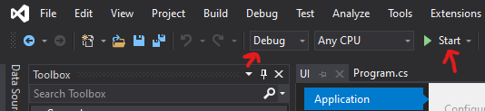

# Project restaurant ordering system
[](https://www.codefactor.io/repository/github/yannick1691/project-building-applications)


This application serves as a restaurant ordering system, assisting restaurants in streamlining the process of ordering and the kitchen.

This project was created for the Term 4 project of Inholland Haarlem.

## Code styling
This project uses codefactor for linting, this checks for duplicate code but also checks against the StyleCop config. See [StyleCop config](./Settings.StyleCop) to see what rules are disabled.

## Build using
- .NET Framework 4.7.2
- Windows Form Application
- Project is subject to using WPF in certain parts

## Getting started
Requirements:
- Visual Studio 2019
- Having the .NET Framework 4.7.2 installed.

To get started clone this repo by using the following in the terminal
```
$ git clone https://github.com/yannick1691/project-building-applications.git
```

After this finishes, you need to open the folder and then open the `ChapeauSolution.sln` file in Visual Studio.

To start the project run the the opened solution in debug mode. Make sure the startup project is set to the UI layer.



## Contributing
To contribute to this project, please create a new branch based of the master branch. 
For the naming of the branch please use a clear name that describes what it will implement.

For commits we advice the use of the [Conventional Commits specification](https://www.conventionalcommits.org/en/v1.0.0/), 
while using [gitmoji](https://gitmoji.carloscuesta.me/) for the type.

So a commit message could for example look like: `:sparkles:(Tables): Add table layout`. 
If the commit is related to a issue please include: `CLOSES: #issueId` in the extended description.

While contributing please be kind to eachother and try to be inclusive and open to feedback, 
feedback should always be aimed at the code and shouldn't be aimed at the person.

While writing code please include documentation comments that describe in minimal who write the code. Prefarrably also with a explanation.

**Example**
```
/// <summary>
/// A method that calculates the sum of A and B.
/// </summary>
///
/// <returns>The sum of A and B</returns>
///
/// <remarks>User, 2020/04/21</remarks>
```

## Contributers
 |  |  | 
--- | --- | --- | ---
[Yannick Frisart](https://github.com/yannick1691) | [Samih al Samman](https://github.com/samihsamman) | [Stephen Holden](https://github.com/Sholden8340) | [Tamanna Abbas](https://github.com/Tamanna299)

## License
Project Restaurant Ordering System </br>
Copyright (C) 2020 Yannick Frisart, Samih al Samman, Stephen Holden, Tamanna Abbas

This program is free software: you can redistribute it and/or modify
it under the terms of the GNU Affero General Public License as published
by the Free Software Foundation, either version 3 of the License, or
(at your option) any later version.

This program is distributed in the hope that it will be useful,
but WITHOUT ANY WARRANTY; without even the implied warranty of
MERCHANTABILITY or FITNESS FOR A PARTICULAR PURPOSE.  See the
GNU Affero General Public License for more details.

You should have received a copy of the GNU Affero General Public License
along with this program.  If not, see <https://www.gnu.org/licenses/>.

To view the full license see the [LICENSE file](./LICENSE).
